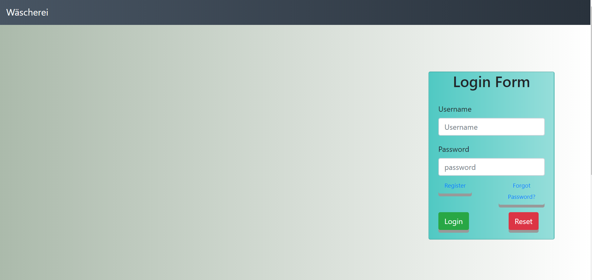
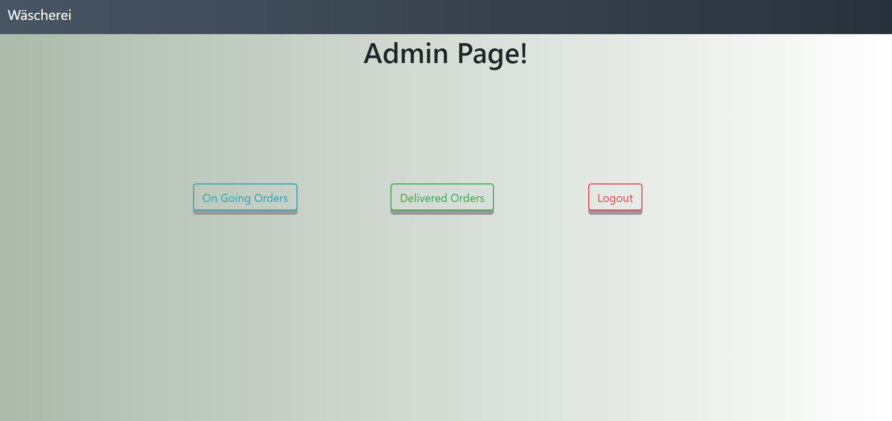
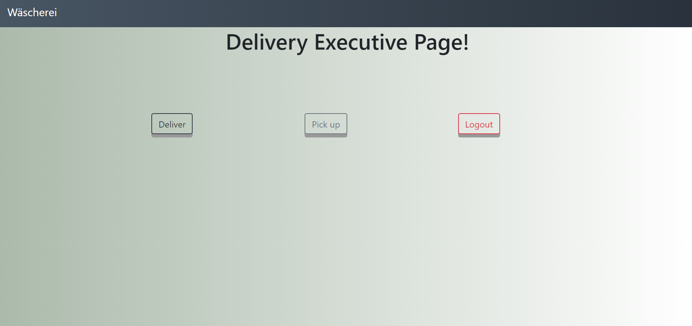
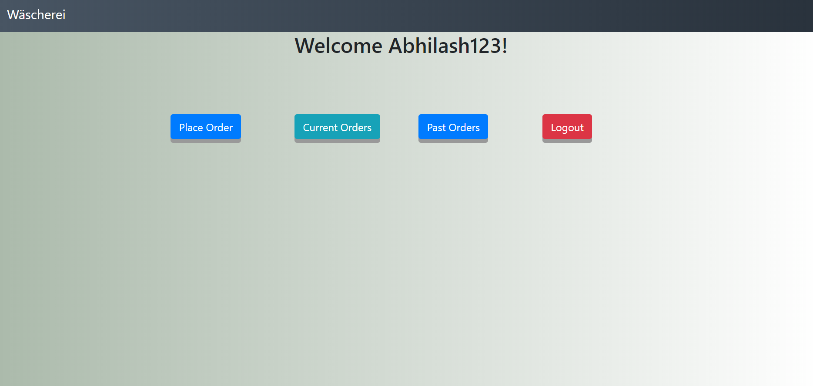

# Laundry-Service-App

As the name tells this app can be used for any laundry service business.Briefly explaining the working of this app, there is 3 types of user in this app which are admin,delivery boy and customer.If any Customer want to use this app he has to register first and then login and then he can place order and then delivery boy will come to pick his cloths. After washing the cloths the delivery boy will again deliver the cloths to that customer.Here everything in this wiil be monitored by the admin.


#### Login Page


#### Admin Page


#### Delivery Boy Page


#### Customer Page



# How to use
1. For admin: His username and password both are "admin" . This username and password is hardcoded  in frontend part.
2. For delivery boy: His username and password both are "deliver" . This username and password is hardcoded  in frontend part.
3. For Customer: Customer has to create his own username and password. This username and password will be stored in the database.

# Getting Started

This project was bootstrapped with [Create React App](https://github.com/facebook/create-react-app)

# Installing

A step by step series of examples that tell you how to get a development env running-

## To run the server

### 1. Go to back-end folder

### 2. Open the back-end folder using eclipse

### 3. Run the project as 'Spring Boot App' in eclipse

## To run the Client Side 

Keep the server running

### 1. Go to front-end folder

### 2. Install all the dependencies

### ```npm install```

### 3. Run the client side

### ```npm start```
